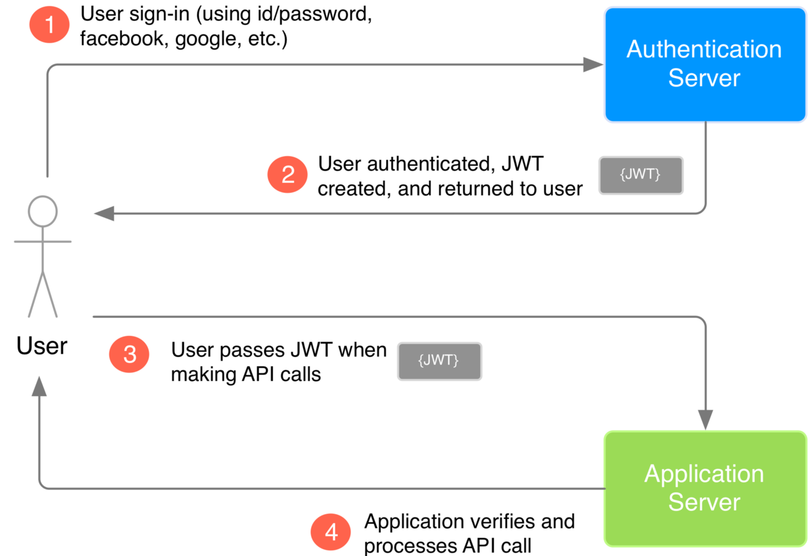
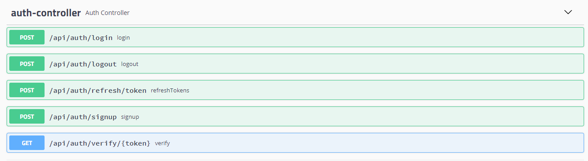
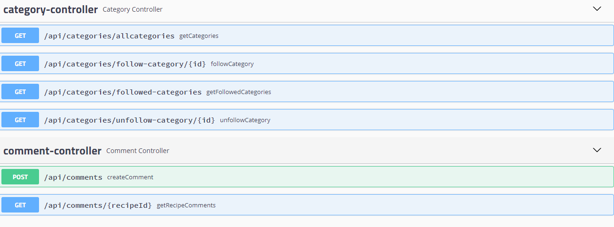
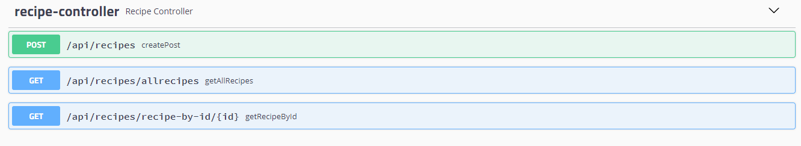

# spring-recipes-api

## Website for recipes built using Spring Boot, Spring Security with JPA Authentication, Spring Data JPA with H2, Spring MVC. The frontend is built using Angular.  You can find the frontend source code here - https://github.com/safalam/angular-recipes
 
### This Rest Api is secured using JWT.

### After sign-up, a verification email is sent to the user (Using JavaMailSender). User needs to go to the link to enable his account.

#### Users follow categories to personalize their home page. Last created recipes appear first.
#### Users add comments to recipes. 

#### Creating new recipes.

#### Swagger Tools are used to document this api.

